# PhishGuard AI — AI-Powered Phishing Email Triage System

A full-stack defensive security application for automated phishing and Business Email Compromise (BEC) detection, risk scoring, and SOC-style analyst reporting.

---

## Security & Ethical Disclaimer

This is a defensive security education and portfolio project. It is designed to help detect and explain phishing and social engineering indicators.

- No URLs are fetched, executed, or resolved.
- No real email content was used in development or training.
- All sample emails are synthetic.
- This tool does not generate phishing content.
- Do not submit emails containing sensitive personal data.
- This project is not intended for production use without additional hardening.

---

## Screenshots

### Dashboard Home

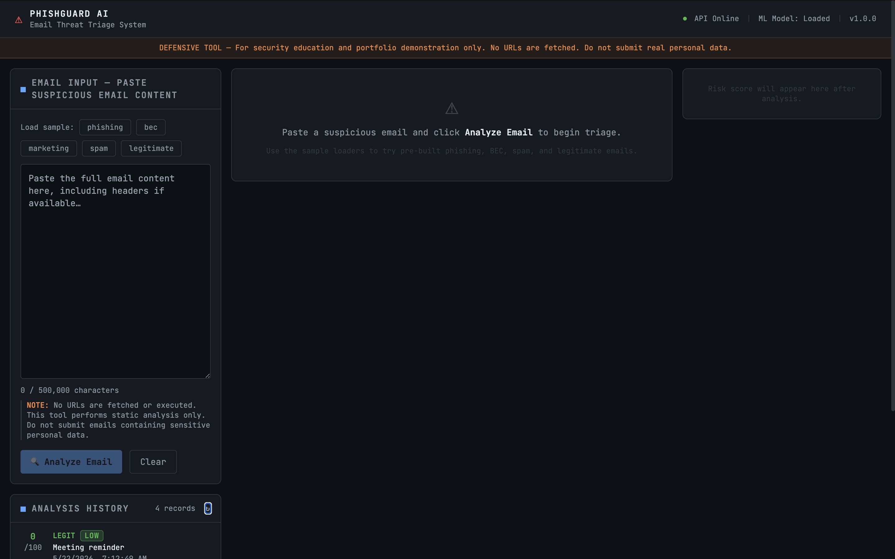

### Phishing Detection Result

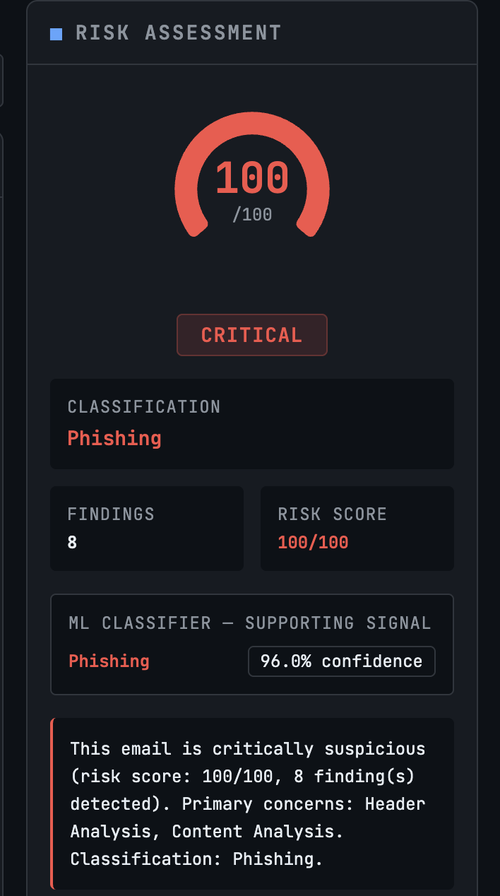

### Phishing Findings

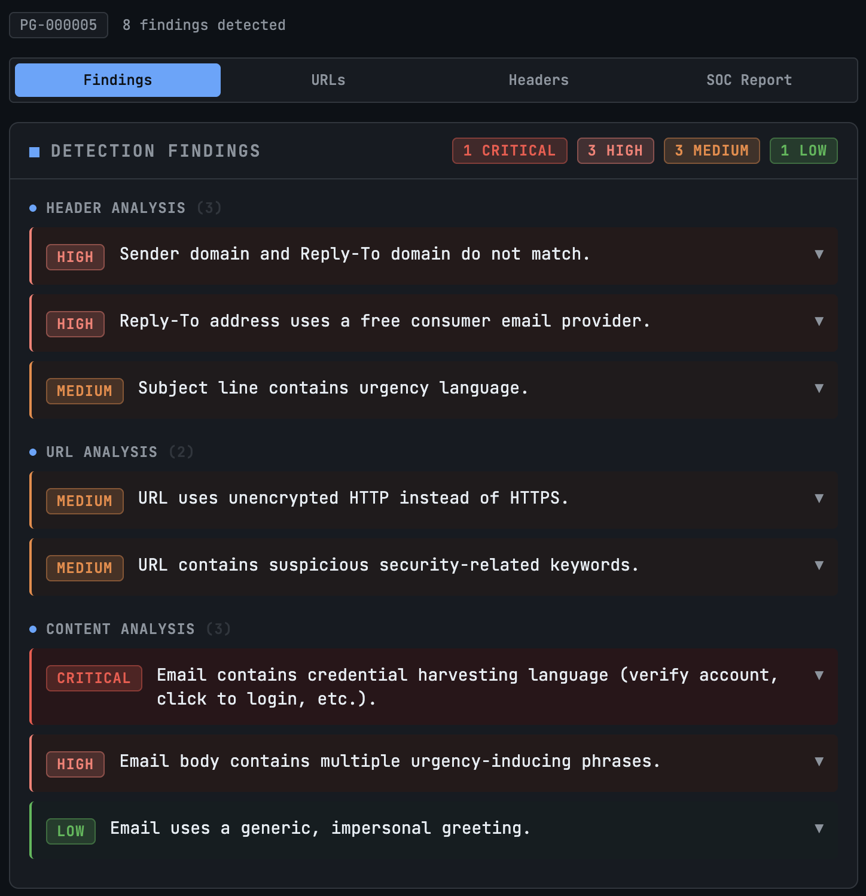

### Phishing SOC Report

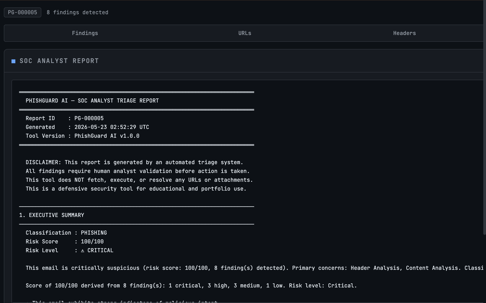

### Business Email Compromise Detection

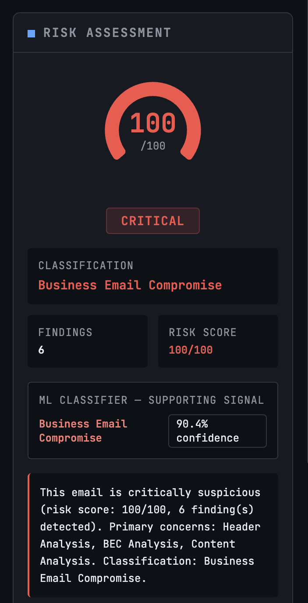

### BEC Findings

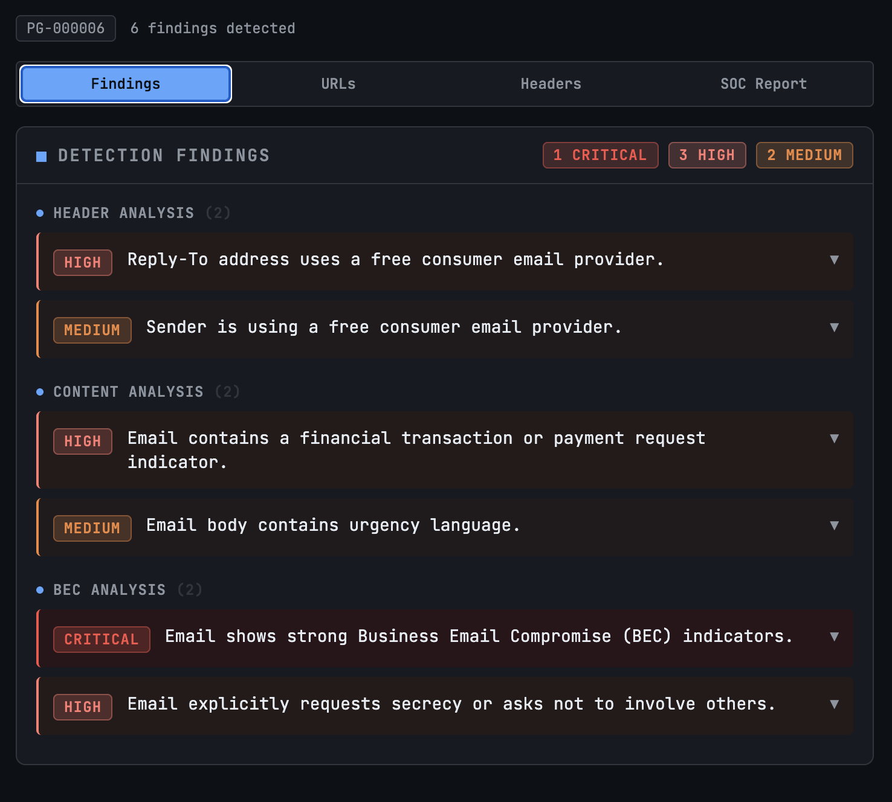

### BEC Recommended Actions

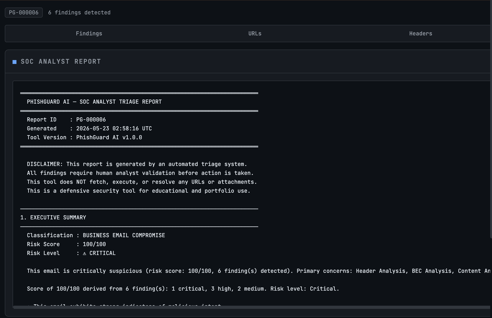

### Low-Confidence ML Handling

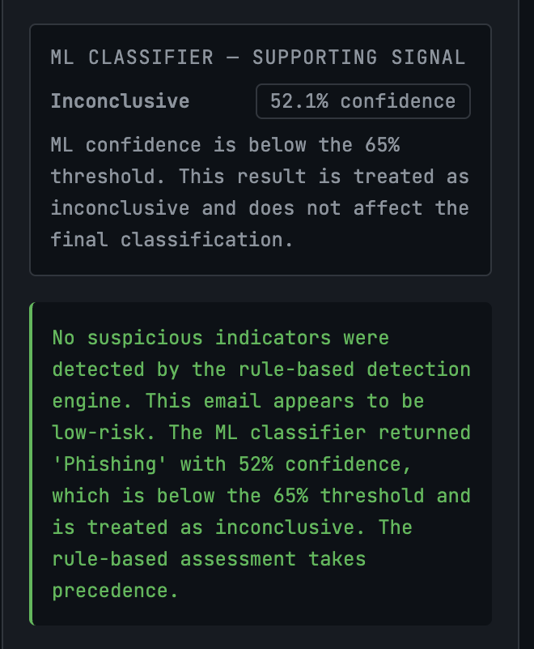

### Marketing / Low-Risk Email Result

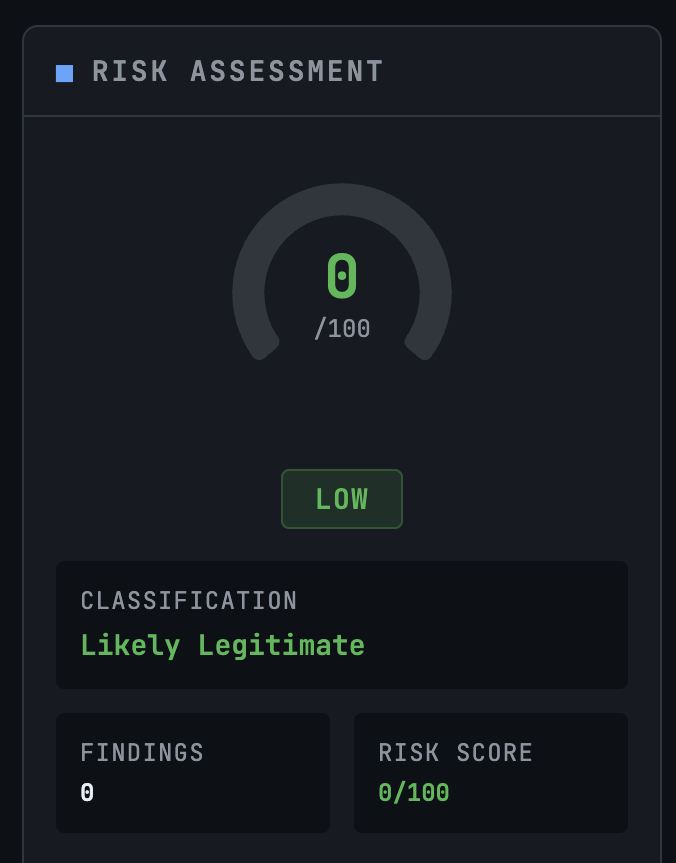

### Legitimate Email Result

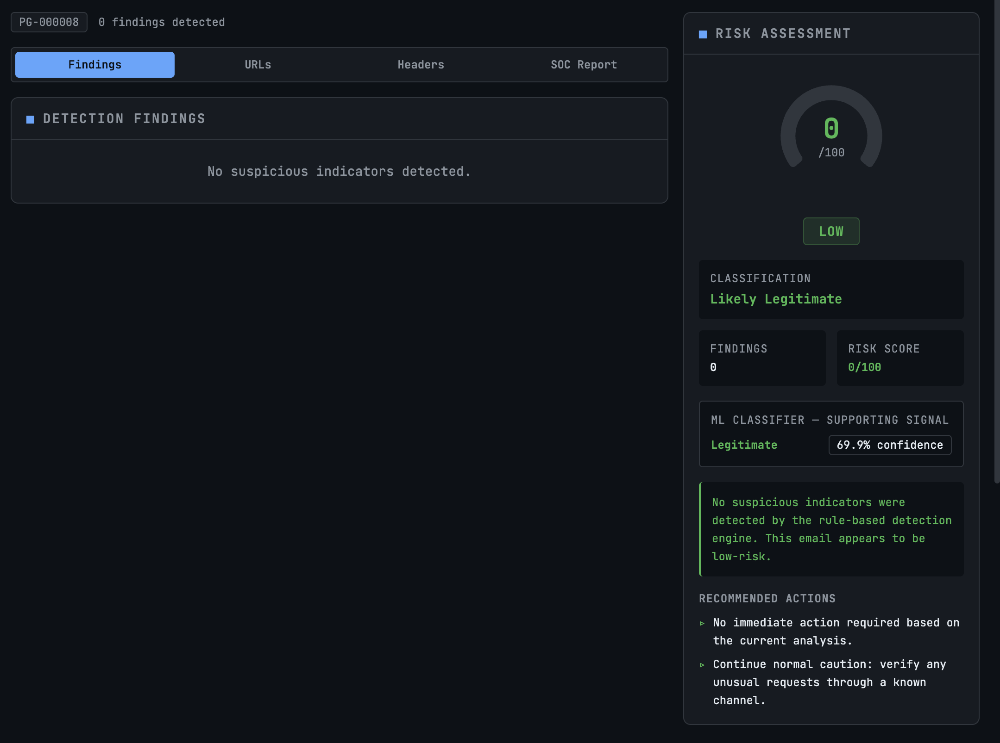

### Analysis History

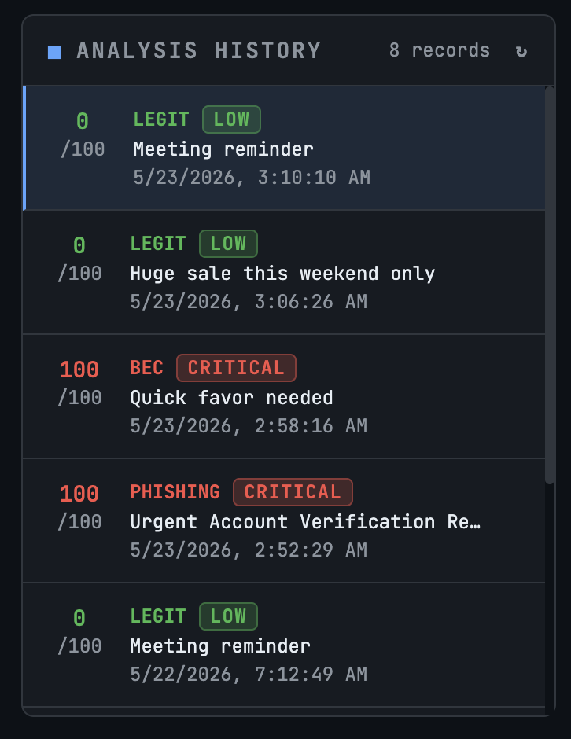

### FastAPI Documentation

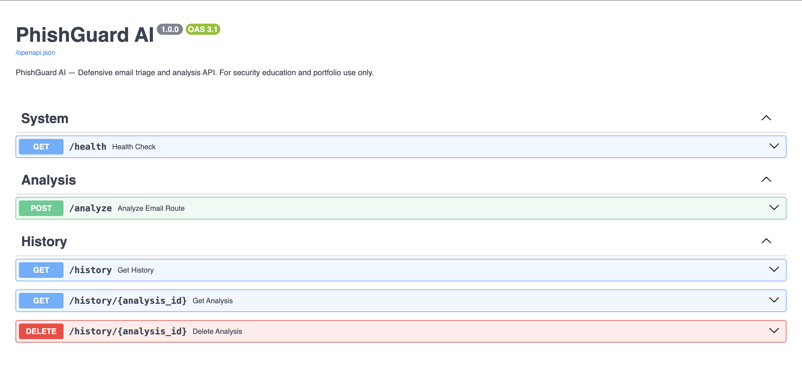

### Backend Tests Passing

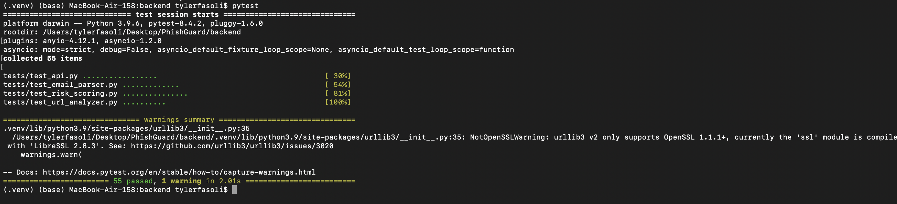

### Frontend Build Passing

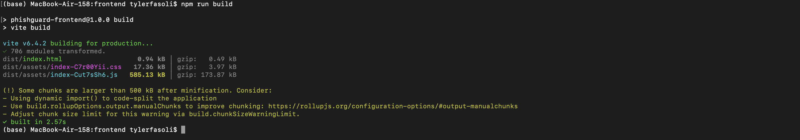

---

## Problem Statement

Phishing and Business Email Compromise are among the most damaging forms of social engineering facing organizations. Security Operations Center analysts often need to triage suspicious emails quickly, identify high-risk indicators, and document findings in a consistent format.

PhishGuard AI provides automated first-pass email triage by combining rule-based detection, machine learning support, risk scoring, and structured SOC-style reporting.

The system helps analysts:

- Surface specific indicators with evidence and severity ratings.
- Explain why an email is suspicious in plain English.
- Generate a structured analyst report suitable for incident documentation.
- Maintain a searchable history of prior analyses.
- Reduce confusion from low-confidence machine learning outputs.

---

## Why This Project Matters

This project was designed to demonstrate practical skills across cybersecurity, artificial intelligence, full-stack development, and secure software engineering.

Rather than being a generic coding project, PhishGuard AI models a realistic security workflow that could support a help desk, SOC team, university IT department, healthcare security office, or government agency.

---

## Government & Public-Sector Use Case

Federal agencies, state governments, universities, healthcare systems, and defense contractors are frequent targets for phishing, spear-phishing, and Business Email Compromise attempts.

PhishGuard AI aligns with public-sector security needs by supporting:

- Defensive email triage.
- Security analyst decision support.
- Incident documentation.
- Risk-based prioritization.
- Human-in-the-loop review.
- Secure AI-assisted analysis.

Relevant public-sector cybersecurity concepts include:

- NIST Cybersecurity Framework detection and response activities.
- CISA-style phishing awareness and layered email defense.
- FISMA-style documentation and incident response support.
- SOC analyst workflow automation.
- Responsible AI use in security operations.

---

## Demonstrated Skills

This project demonstrates experience with:

- Defensive cybersecurity tooling.
- Phishing and BEC detection logic.
- Email header, URL, and content analysis.
- AI/ML integration in a security context.
- Full-stack application development.
- FastAPI backend development.
- React dashboard development.
- SQLite and SQLAlchemy persistence.
- DevSecOps practices.
- Docker-based deployment.
- GitHub Actions CI/CD.
- Security documentation and threat modeling.
- SOC-style reporting and analyst communication.

---

## Features

| Feature | Description |
|---|---|
| Multi-stage detection | Header, URL, content, and BEC analysis in separate detection stages |
| 40+ detection rules | Detects phishing, credential harvesting, payment fraud, urgency language, suspicious URLs, and BEC patterns |
| ML classification | TF-IDF + LinearSVC classifier for phishing, BEC, spam, and legitimate emails |
| ML confidence thresholding | Predictions below 65% confidence are shown as `Inconclusive` to prevent false alarms |
| 0–100 risk score | Severity-weighted scoring with clear risk levels |
| SOC report generation | Structured analyst reports using PG-XXXXXX report identifiers |
| Analysis history | SQLite-backed storage of previous analyses |
| Professional dashboard | React dashboard for email input, findings, risk score, reports, and history |
| Synthetic sample emails | Includes safe phishing, BEC, spam, legitimate, and low-confidence examples |
| Docker deployment | Full-stack local deployment with Docker Compose |
| CI/CD pipeline | GitHub Actions workflow for testing, security scanning, and frontend build validation |

---

## Tech Stack

### Backend

| Technology | Purpose |
|---|---|
| Python 3.9+ | Backend runtime |
| FastAPI | REST API framework |
| Pydantic v2 | Input validation and response schemas |
| SQLAlchemy | ORM for SQLite persistence |
| SQLite | Local database for analysis history |
| scikit-learn | ML classification pipeline |
| BeautifulSoup4 | HTML email body parsing |
| tldextract | Domain and subdomain parsing |
| pytest | Backend test suite |

### Frontend

| Technology | Purpose |
|---|---|
| React 18 | User interface |
| Vite | Frontend build tool and dev server |
| Tailwind CSS | Styling |
| Axios | API client |
| Recharts | Risk score visualization |

### DevOps and Security

| Technology | Purpose |
|---|---|
| Docker | Containerization |
| Docker Compose | Local full-stack orchestration |
| GitHub Actions | CI/CD pipeline |
| Bandit | Python static security scanning |
| pip-audit | Python dependency vulnerability scanning |
| ESLint | Frontend code quality |

---

## Architecture

```text
Browser (React)
      |
      v
FastAPI Backend
      |
      +--> Email Parser
      |
      +--> Header Analyzer
      |
      +--> URL Analyzer
      |
      +--> Content Analyzer
      |
      +--> BEC Analyzer
      |
      +--> ML Classifier
      |
      v
Risk Scoring Engine
      |
      +--> SOC Report Generator
      |
      v
SQLite Analysis History
```

For more detail, see:

- [`docs/architecture.md`](docs/architecture.md)
- [`docs/detection_logic.md`](docs/detection_logic.md)
- [`docs/threat_model.md`](docs/threat_model.md)
- [`docs/soc_workflow.md`](docs/soc_workflow.md)

---

## Detection Pipeline

PhishGuard AI uses a layered detection pipeline.

### 1. Email Parser

Extracts:

- Sender
- Reply-To
- Recipient
- Subject
- Date
- Body
- URLs
- Domains
- Header presence

The parser supports both full RFC-style raw emails and simple pasted emails with header-like lines.

### 2. Header Analysis

Detects:

- Sender and Reply-To mismatch.
- Free consumer email provider use.
- Missing or malformed sender.
- Suspicious sender domain.
- Urgent subject lines.

### 3. URL Analysis

Detects:

- HTTP instead of HTTPS.
- IP-based URLs.
- URL shorteners.
- Excessive subdomains.
- Suspicious security-related keywords.
- Punycode domains.
- Brand impersonation indicators.

### 4. Content Analysis

Detects:

- Urgency language.
- Threatening language.
- Credential harvesting phrases.
- Payment request language.
- Gift card and wire transfer language.
- MFA reset or password reset language.
- Generic greetings.
- Secrecy requests.

### 5. Business Email Compromise Analysis

Detects:

- Executive impersonation.
- Wire transfer requests.
- Vendor payment change requests.
- Secrecy language.
- Invoice urgency.
- Unusual financial requests.

---

## Risk Scoring

Findings are assigned severity levels and converted into a 0–100 risk score.

| Severity | Points |
|---|---:|
| Critical | 30 |
| High | 20 |
| Medium | 10 |
| Low | 5 |

Risk levels:

| Score | Risk Level |
|---:|---|
| 0–20 | Low |
| 21–50 | Medium |
| 51–75 | High |
| 76–100 | Critical |

---

## Classifications

| Internal Code | Display Label | Description |
|---|---|---|
| `phishing` | Phishing | Credential harvesting, suspicious links, or malicious email indicators |
| `business_email_compromise` | Business Email Compromise | CEO/vendor impersonation, wire fraud, or payment manipulation |
| `spam` | Spam | Unsolicited bulk or promotional email |
| `likely_legitimate` | Likely Legitimate | No significant threat indicators found |
| `inconclusive` | Inconclusive | ML confidence below threshold; rule-based engine remains authoritative |

---

## ML Confidence Thresholding

The machine learning classifier returns both a prediction and a confidence score.

Predictions below the 65% confidence threshold are displayed as:

```text
Inconclusive
```

This prevents low-confidence model outputs from creating unnecessary alarm.

For example, if the rule-based engine finds zero suspicious indicators but the ML model weakly predicts phishing at 52% confidence, the final classification remains:

```text
Likely Legitimate
```

The system explains that the ML result did not meet the confidence threshold and does not override the rule-based analysis.

This design reflects a human-in-the-loop security approach where machine learning supports analysts but does not blindly replace deterministic security logic.

---

## Getting Started

### Prerequisites

Recommended:

- Docker and Docker Compose

For local development without Docker:

- Python 3.9+
- Node.js 20+
- npm

---

## Run with Docker

```bash
git clone https://github.com/tfasoli2020/phishguard-ai.git
cd phishguard-ai

cp .env.example .env

docker compose up --build
```

Docker URLs:

```text
Frontend: http://localhost:3000
Backend API: http://localhost:8000
API Docs: http://localhost:8000/docs
```

---

## Run Locally Without Docker

### Backend

```bash
cd backend
python3 -m venv .venv
source .venv/bin/activate

pip install -r requirements.txt

uvicorn app.main:app --reload --port 8000
```

Backend URLs:

```text
Backend API: http://localhost:8000
API Docs: http://localhost:8000/docs
```

### Frontend

Open a second terminal:

```bash
cd frontend
npm install
npm run dev
```

Frontend URL:

```text
http://localhost:5173
```

---

## API Documentation

Interactive API documentation is available at:

```text
http://localhost:8000/docs
```

### POST `/analyze`

Analyzes suspicious email content.

Example request:

```json
{
  "email_text": "From: attacker@evil.com\nSubject: Urgent Account Alert\n\nClick here: http://phish.example.com"
}
```

Example response:

```json
{
  "analysis_id": 1,
  "classification": "phishing",
  "classification_label": "Phishing",
  "risk_score": 75,
  "risk_level": "High",
  "summary": "This email is highly suspicious due to multiple phishing indicators.",
  "email_metadata": {
    "sender": "attacker@evil.com",
    "reply_to": "",
    "recipient": "",
    "subject": "Urgent Account Alert",
    "date": "",
    "domains": ["phish.example.com"],
    "urls": ["http://phish.example.com"]
  },
  "ml_prediction": "phishing",
  "ml_confidence": 0.84,
  "findings": [
    {
      "category": "URL Analysis",
      "severity": "medium",
      "finding": "URL uses unencrypted HTTP instead of HTTPS.",
      "evidence": "http://phish.example.com",
      "recommendation": "Avoid clicking untrusted links and verify through official channels."
    }
  ],
  "recommended_actions": [
    "Do not click any links or download attachments.",
    "Report this email to the security operations team."
  ],
  "report": "======== PHISHGUARD AI — SOC ANALYST REPORT ========"
}
```

### Other Endpoints

| Method | Endpoint | Description |
|---|---|---|
| GET | `/health` | Returns API and ML model health status |
| GET | `/history` | Returns recent analysis history |
| GET | `/history/{id}` | Returns details for a specific analysis |
| DELETE | `/history/{id}` | Deletes a specific analysis record |

---

## Running Tests

### Backend Tests

```bash
cd backend
source .venv/bin/activate
pytest
```

Current backend validation:

```text
55 passed
```

Test coverage includes:

- Email parser behavior.
- Header extraction.
- URL extraction.
- Quoted display-name senders.
- Preamble handling.
- BEC no-false-sender regression.
- URL analyzer rules.
- Risk scoring thresholds.
- Classification label propagation.
- ML confidence thresholding.
- API integration.
- History CRUD behavior.

### Frontend Build

```bash
cd frontend
npm run build
```

A successful build should end with:

```text
✓ built in ...
```

---

## Sample Emails

Synthetic test emails are stored in:

```text
data/sample_emails/
```

Included samples:

| File | Purpose |
|---|---|
| `phishing_email_1.txt` | Credential harvesting and suspicious URL example |
| `bec_email_1.txt` | Business Email Compromise and wire transfer scenario |
| `spam_email_1.txt` | Promotional or unsolicited email example |
| `legitimate_email_1.txt` | Benign meeting reminder example |
| `low_confidence_marketing_email.txt` | Demonstrates ML confidence thresholding |

All samples are synthetic and safe for educational use.

---

## Sample Manual Test Cases

### Phishing Email

Expected result:

```text
Classification: Phishing
Risk: Critical
ML: High-confidence phishing
```

### Business Email Compromise Email

Expected result:

```text
Classification: Business Email Compromise
Risk: Critical
ML: High-confidence Business Email Compromise
```

### Marketing / Low-Confidence Email

Expected result:

```text
Classification: Likely Legitimate
Risk: Low
ML: Inconclusive if confidence is below 65%
```

### Legitimate Email

Expected result:

```text
Classification: Likely Legitimate
Risk: Low
ML: Legitimate
```

---

## Project Structure

```text
phishguard-ai/
├── .github/
│   └── workflows/
│       └── ci.yml
├── backend/
│   ├── app/
│   │   ├── main.py
│   │   ├── config.py
│   │   ├── database.py
│   │   ├── models/
│   │   ├── routes/
│   │   ├── services/
│   │   └── utils/
│   ├── tests/
│   ├── requirements.txt
│   └── Dockerfile
├── data/
│   └── sample_emails/
├── docs/
│   ├── screenshots/
│   ├── architecture.md
│   ├── detection_logic.md
│   ├── resume_bullets.md
│   ├── soc_workflow.md
│   └── threat_model.md
├── frontend/
│   ├── src/
│   │   ├── api/
│   │   └── components/
│   ├── package.json
│   └── Dockerfile
├── notebooks/
│   └── model_training_baseline.ipynb
├── .env.example
├── .gitignore
├── docker-compose.yml
├── LICENSE
└── README.md
```

---

## Documentation

| Document | Description |
|---|---|
| [`docs/architecture.md`](docs/architecture.md) | System architecture and component design |
| [`docs/detection_logic.md`](docs/detection_logic.md) | Rule-based detection and risk scoring |
| [`docs/threat_model.md`](docs/threat_model.md) | Security threat model for the tool itself |
| [`docs/soc_workflow.md`](docs/soc_workflow.md) | How a SOC analyst would use the tool |
| [`docs/resume_bullets.md`](docs/resume_bullets.md) | Resume bullets tailored to different technical roles |

---

## CI/CD Pipeline

The GitHub Actions workflow validates the project on push and pull request.

The pipeline includes:

- Backend dependency installation.
- Backend pytest suite.
- Bandit static application security testing.
- pip-audit dependency vulnerability scanning.
- Frontend dependency installation.
- Frontend production build.

Workflow file:

```text
.github/workflows/ci.yml
```

---

## Resume Bullet Examples

### Full Version

Built **PhishGuard AI**, a full-stack phishing and Business Email Compromise triage platform using FastAPI, React, SQLite, SQLAlchemy, and scikit-learn, implementing 40+ detection rules across email headers, URLs, sender behavior, urgency language, credential-harvesting indicators, and BEC patterns. Added ML-assisted classification with confidence thresholding, SOC-style analyst reports, tailored remediation actions, analysis history, and 55 automated backend tests.

### Short Version

Built **PhishGuard AI**, a full-stack cybersecurity triage platform using FastAPI, React, SQLite, and scikit-learn to detect phishing and Business Email Compromise indicators, generate risk scores, apply ML confidence thresholding, and produce SOC-style analyst reports.

---

## Limitations

This project is a defensive educational prototype and has several limitations:

- No attachment scanning.
- No live URL fetching.
- No malicious page sandboxing.
- No DKIM/SPF/DMARC validation.
- No real-time threat intelligence integration.
- ML model trained on synthetic sample data.
- English-language pattern matching only.
- No authentication or multi-user role system.
- Not intended for production use without additional hardening.

---

## Future Improvements

Potential future enhancements:

- Add DKIM/SPF/DMARC header validation.
- Integrate optional VirusTotal or URL reputation APIs.
- Expand the ML training corpus.
- Add MITRE ATT&CK technique mapping.
- Add safe attachment metadata analysis.
- Add authentication and role-based access control.
- Export reports to PDF.
- Export findings to JSON/CSV for SIEM ingestion.
- Add Slack or Teams notification support for critical findings.
- Add deployment instructions for cloud hosting.

---

## License

This project is licensed under the MIT License. See [`LICENSE`](LICENSE) for details.

---

## Disclaimer

PhishGuard AI is a defensive security portfolio project. It is not affiliated with any government agency, law enforcement body, or commercial security vendor.

Do not use this project to generate, improve, or deploy phishing campaigns. This tool is intended only for defensive security education, detection, and analyst support.